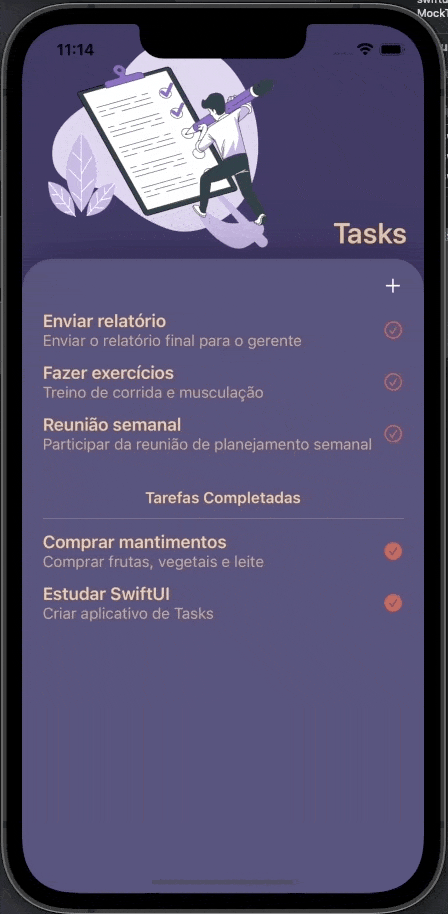
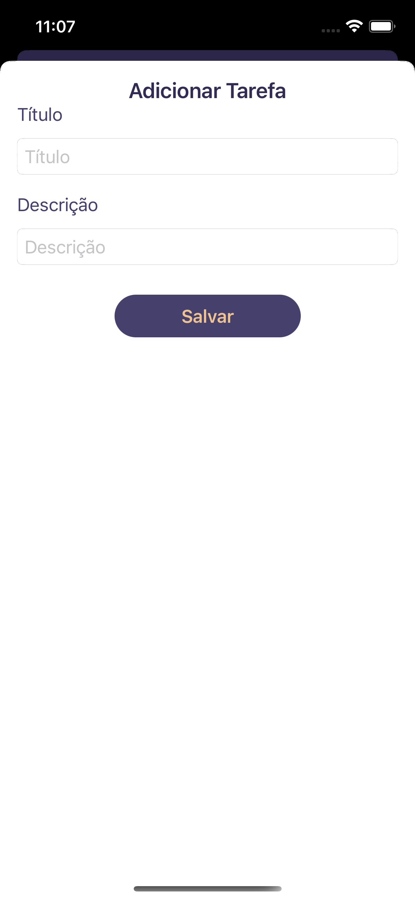

# 📝 To-do List SwiftUI / MVVM / Testes Unitários

Projeto de um **app To-do List** utilizando a arquitetura **MVVM**, interfaces implementadas com **SwiftUI** e **Testes Unitários** com **XCTest** nativo. Este projeto inclui:

✨ **Principais Funcionalidades**:
- Arquitetura **MVVM** para separação de responsabilidades;
- Implementação de interfaces com **SwiftUI**;
- Testes Unitários de **ViewModels**, **Repository** e **Interfaces** com **XCTest**;
- Mocks para testes unitários e visualização correta de previews;
- Persistência de dados com **UserDefaults**;
- Utilização de **protocols** para persistência com **UserDefaults**;
- Estruturas (`structs`) customizadas;
- Adição e exclusão de tarefas;
- Marcar/desmarcar tarefas como concluídas;
- Animações suaves para as ações de marcar/desmarcar e exclusão de tarefas;
- Ação de exclusão com gesto nativo de **arrastar para o lado** em listas;
- Listas separadas para **tarefas completadas** e **incompletas**.

## 🛠 Requisitos
- **macOS** 11 ou superior
- **Xcode** 12 ou superior
- **Swift** 5.3 ou superior

## 📦 Dependências Externas
Este projeto **não possui dependências externas**, como web services. Basta rodar o projeto diretamente para utilizá-lo.

## 📸 Imagens

  
  
  

## 🚀 Como Rodar o Projeto
1. Abra o projeto no **Xcode**.
2. Selecione um simulador ou dispositivo real.
3. Execute o app clicando no botão **Run** ou usando o atalho `Cmd + R`.

## 🔍 Testes
- Para rodar os **Testes Unitários**, selecione o target de teste e use `Cmd + U` no **Xcode**.
- Os testes cobrem:
  - **ViewModels**;
  - **Repository**;
  - **Interfaces**;
  - Previews com **Mocks**.

## 📄 Licença

Copyright (c) 2024 Fernando Schulz

Permission is hereby granted, free of charge, to any person obtaining a copy of this software and associated documentation files (the "Software"), to deal in the Software without restriction, including without limitation the rights to use, copy, modify, merge, publish, distribute, sublicense, and/or sell copies of the Software, and to permit persons to whom the Software is furnished to do so, subject to the following conditions:

The above copyright notice and this permission notice shall be included in all copies or substantial portions of the Software.

THE SOFTWARE IS PROVIDED "AS IS", WITHOUT WARRANTY OF ANY KIND, EXPRESS OR IMPLIED, INCLUDING BUT NOT LIMITED TO THE WARRANTIES OF MERCHANTABILITY, FITNESS FOR A PARTICULAR PURPOSE AND NONINFRINGEMENT. IN NO EVENT SHALL THE AUTHORS OR COPYRIGHT HOLDERS BE LIABLE FOR ANY CLAIM, DAMAGES OR OTHER LIABILITY, WHETHER IN AN ACTION OF CONTRACT, TORT OR OTHERWISE, ARISING FROM, OUT OF OR IN CONNECTION WITH THE SOFTWARE OR THE USE OR OTHER DEALINGS IN THE SOFTWARE.
